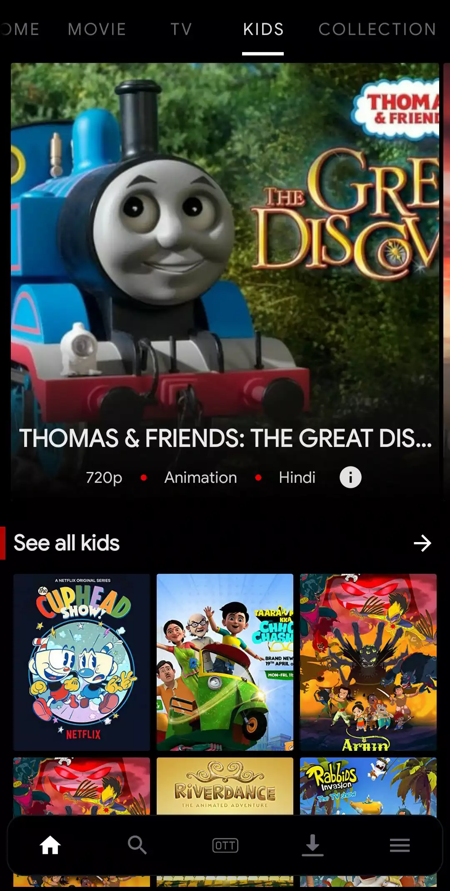

<body>
 <h1 align="center">~ Mvilaa ~</h1>
  
  

   
  

 
  
<!--   <ul>
<li>Line 1</li>
<li>Line 2</li>
</ul> -->
  
**⚠️Current status : We are really sorry to say that this app has been discontinued, as this app required a lot of resources to run, so due to lack of time we had to close the app..**

**✨Brief overview :** Mvilaa offers the largest collection of Bollywood, Hollywood, Hindi dubbed, Gujarati, South Indian, Spanish, French, Punjabi, Marathi, Korean dramas, and Chinese movies.
You can enjoy all the high-quality movies. This app will keep you entertained, but we are sorry that the app is closed now.

<h3 align="center">~ 🖼Screenshots🖼 ~</h3>
  

</body>
